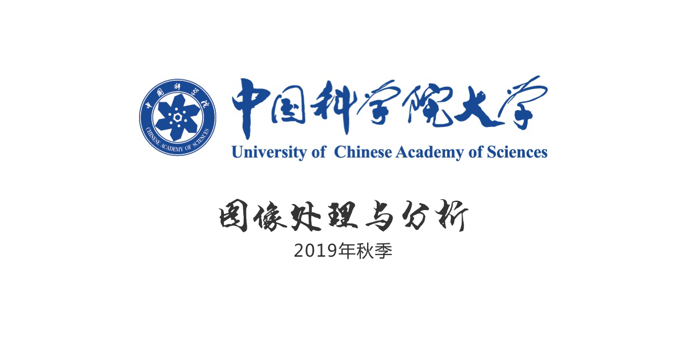

# 中国科学院大学图像处理与分析

## 课程信息
- 日期： 2019年9月-2020年1月
- 时间： 每周四下午7:00-9:30
- 地点： 教1楼009

## 答疑指南

1. [创建议题](https://help.github.com/cn/articles/creating-an-issue)
2. [关于议题](https://help.github.com/cn/articles/about-issues)

